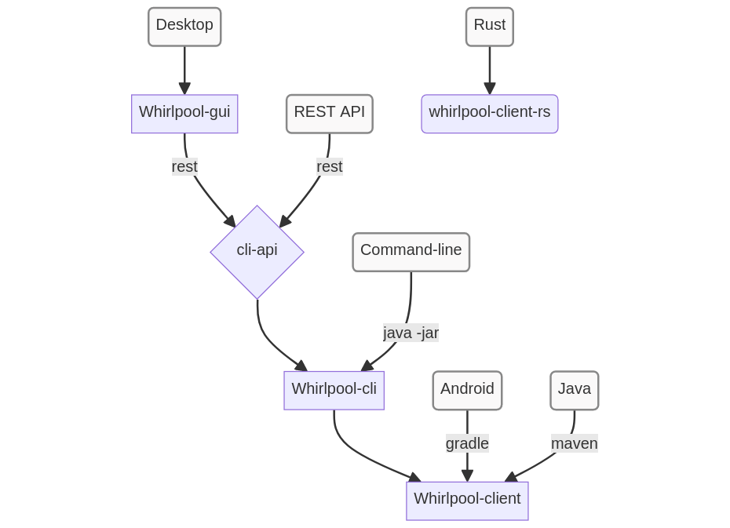
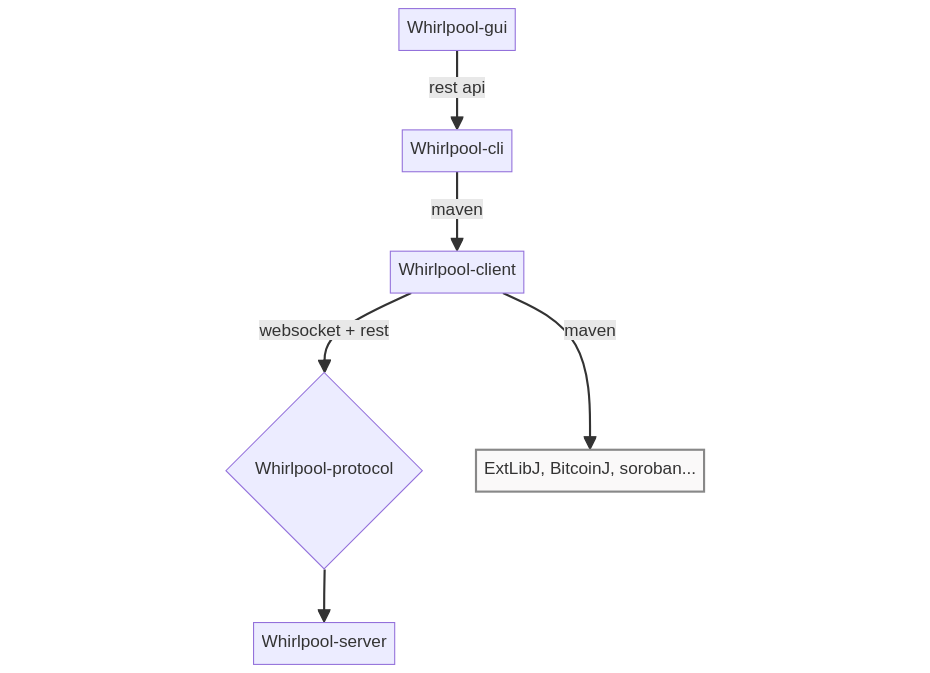
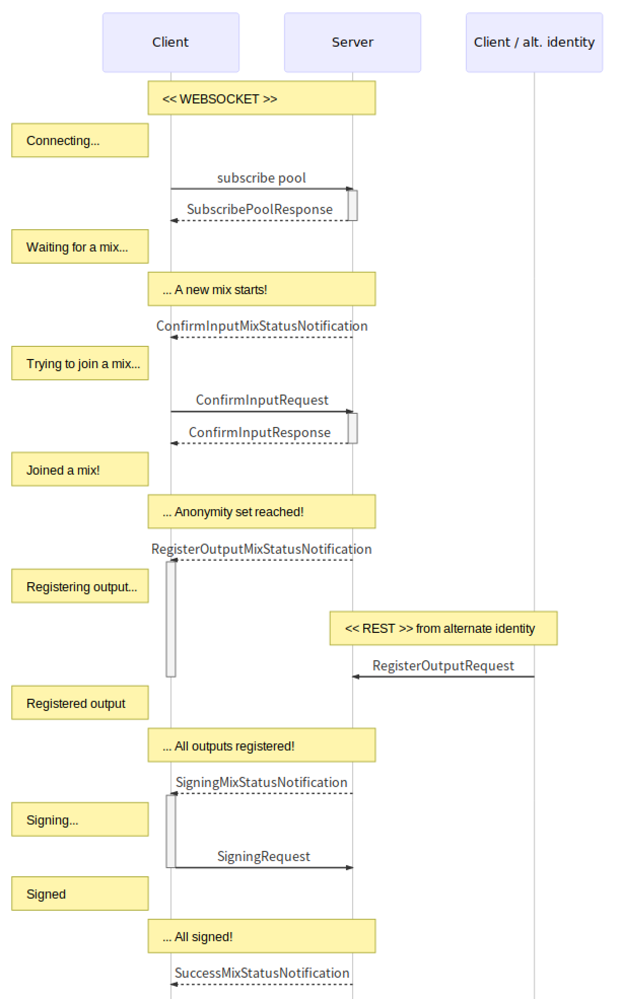

# Whirlpool architecture

## I. Usage
Whirlpool can be managed:
- from desktop: `whirlpool-gui`
- from command line: `whirlpool-cli`
- from REST API for developers: `whirlpool-cli API`
- from JAVA & Android: `whirlpool-client`

## II. Modules
Whirlpool is modular:
- 4 java modules: `server`, `client`, `protocol`, `cli`
- 1 electron/react module: `GUI`

`client` and `server` communicate through `protocol`.

## III. Cycle dialog
Dialog is described in `whirlpool-protocol`, implemented in `whirlpool-client` and `whirlpool-server`.

