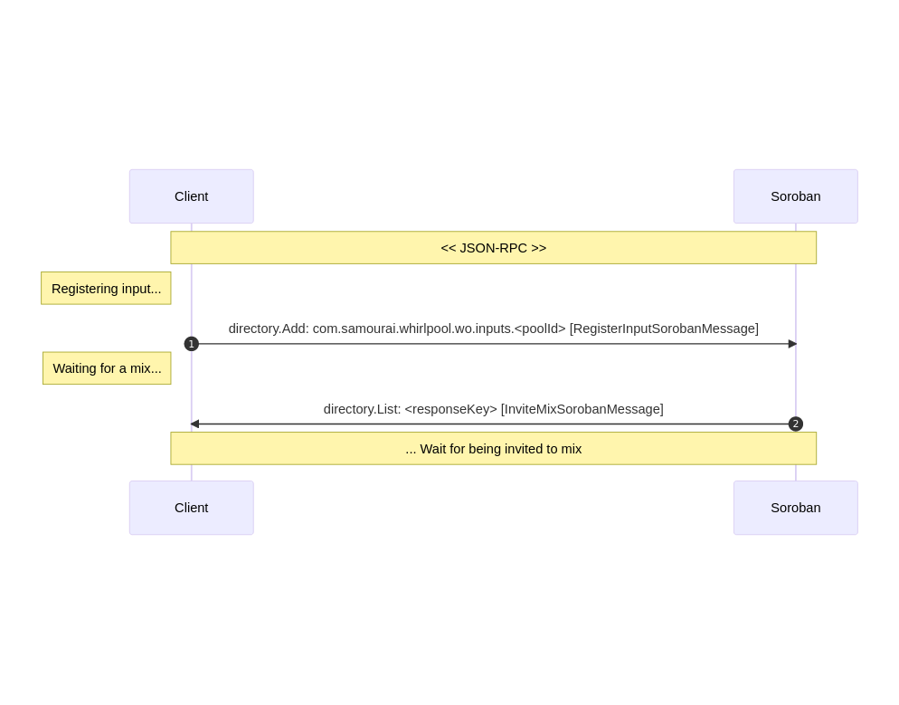
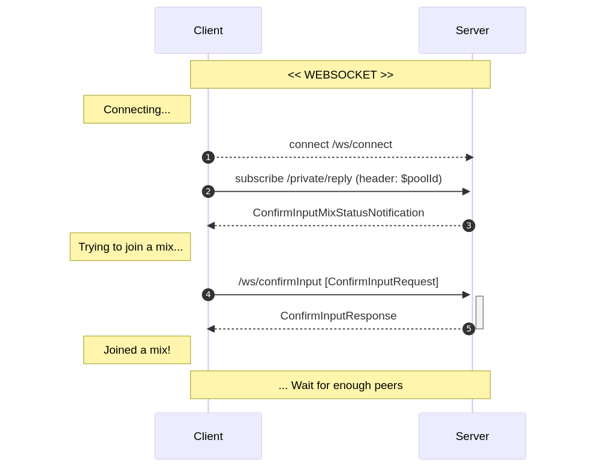
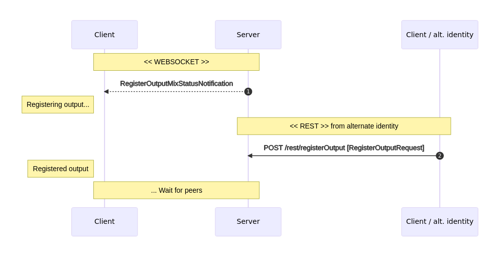
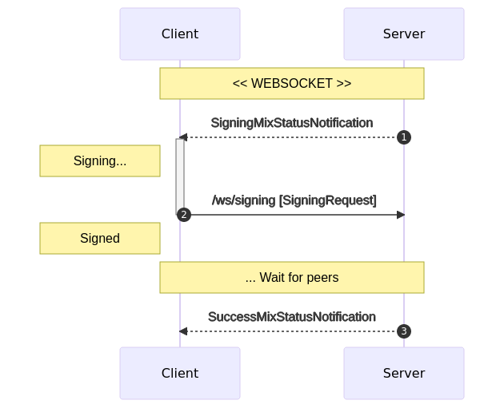
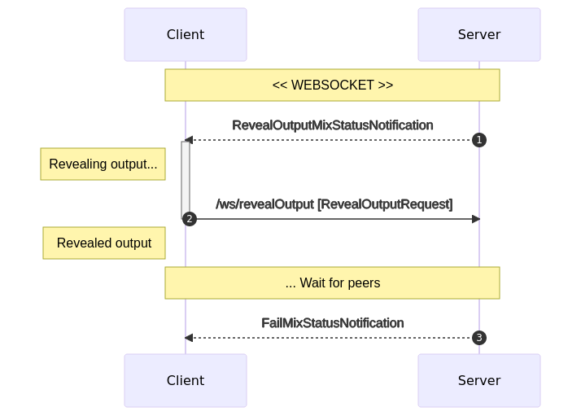
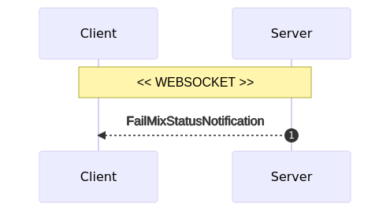
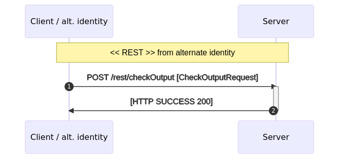

# Whirlpool architecture

## I. Usage
Whirlpool can be managed:
- from desktop: `whirlpool-gui`
- from command line: `whirlpool-cli`
- from REST API for developers: `whirlpool-cli API`
- from JAVA & Android: `whirlpool-client`

## II. Modules
Whirlpool is modular:
- 4 java modules: `server`, `client`, `protocol`, `cli`
- 1 electron/react module: `GUI`

`client` and `server` communicate through `protocol`.

## III. Cycle dialog
Dialog is:
- over STOMP websocket
- described in `whirlpool-protocol`
- implemented in `whirlpool-client` with classes _`MixProcess.java`_, _`MixSession.java`_, _`MixClient.java`_
- each message requires STOMP header: $protocolVersion

### A. Succesful mix process
This is the standard mix process.

#### 1. CONNECT & REGISTER_INPUT

- Client submits [`RegisterInputRequest`](https://code.samourai.io/whirlpool/whirlpool-protocol/-/blob/develop/src/main/java/com/samourai/whirlpool/protocol/websocket/messages/RegisterInputRequest.java):
    - `poolId`: obtained from /rest/pools
    - `utxoHash` + `utxoIndex`: a PREMIX or POSTMIX utxo
    - `signature`: message "$poolId" signed with utxo's key
    - `liquidity`: true for PREMIX, false for POSTMIX

#### 2. CONFIRM_INPUT

- Client receives [`ConfirmInputMixStatusNotification`](https://code.samourai.io/whirlpool/whirlpool-protocol/-/blob/develop/src/main/java/com/samourai/whirlpool/protocol/websocket/notifications/ConfirmInputMixStatusNotification.java):
    - `mixId`: unique identifier of the mix round to join
    - `publicKey64`: public key to use for chaumian blinding

- Client generates a fresh POSTMIX `receiveAddress` (bech32) which was **NEVER used** yet, including in failed mixs. See checkOutput for this.
- Client generates a fresh `RSABlindingParameters` from `publicKey64`
- Client submits [`ConfirmInputRequest`](https://code.samourai.io/whirlpool/whirlpool-protocol/-/blob/develop/src/main/java/com/samourai/whirlpool/protocol/websocket/messages/ConfirmInputRequest.java):
    - `mixId`
    - `blindedBordereau64` = `chaumianBlind(receiveAddress, RSABlindingParameters)`
    - `userHash`: identifier which should be unique for {wallet, mixId}.  
We use this to prevent Client to mix with its own wallet when using multiple instances simultaneously (Android, CLI).  
It can be anything as long as it changes with mixId. We use: `sha256(mixId + sha256(premix00Bech32))`

- Client submits [`ConfirmInputResponse`](https://code.samourai.io/whirlpool/whirlpool-protocol/-/blob/develop/src/main/java/com/samourai/whirlpool/protocol/websocket/messages/ConfirmInputResponse.java):
    - `signedBordereau64`: chaumian signature of `blindedBordereau64` for the mix

#### 3. REGISTER_OUTPUT

- Client receives [`RegisterOutputMixStatusNotification`](https://code.samourai.io/whirlpool/whirlpool-protocol/-/blob/develop/src/main/java/com/samourai/whirlpool/protocol/websocket/notifications/RegisterOutputMixStatusNotification.java):
    - `inputsHash`: hash of all mixs inputs = `sha512(join(sort(inputHash+inputIndex)))` used as anonymous mix round identifier.

- Client increments it's local POSTMIX counter to make sure that it won't ever submit again this `receiveAddress`, even if mix fails.

- Client submits [`RegisterOutputRequest`](https://code.samourai.io/whirlpool/whirlpool-protocol/-/blob/develop/src/main/java/com/samourai/whirlpool/protocol/rest/RegisterOutputRequest.java) through a different identity:
    - `inputsHash`
    - `unblindedSignedBordereau64` = `chamianUnblind(signedBordereau64, RSABlindingParameters)`
    - `receiveAddress`

- If `RegisterOutputRequest` fails, Client should run `CheckOutput` process (see below).

#### 4. SIGNING & SUCCESS

- Client receives [`SigningMixStatusNotification`](https://code.samourai.io/whirlpool/whirlpool-protocol/-/blob/develop/src/main/java/com/samourai/whirlpool/protocol/websocket/notifications/SigningMixStatusNotification.java):
    - `transaction64`: raw transaction to sign

- Client checks that `inputsHash` matches
- Client checks it's input among tx inputs
- Client checks it's output among tx outputs
- Client generates `witnesses64` by signing the transaction
- Client submits [`SigningRequest`](https://code.samourai.io/whirlpool/whirlpool-protocol/-/blob/develop/src/main/java/com/samourai/whirlpool/protocol/websocket/messages/SigningRequest.java):
    - `mixId`
    - `witnesses64`
- Client receives [`SuccessMixStatusNotification`](https://code.samourai.io/whirlpool/whirlpool-protocol/-/blob/develop/src/main/java/com/samourai/whirlpool/protocol/websocket/notifications/SuccessMixStatusNotification.java)

### B. Mix failure

#### 1. REVEAL_OUTPUT process
This process will trigger if a peer fails to REGISTER_OUTPUT, causing the mix to fail.  
Each client should reveal its registered output to coordinator, which will find and blame the faulty client.

- Client receives [`RevealOutputMixStatusNotification`](https://code.samourai.io/whirlpool/whirlpool-protocol/-/blob/develop/src/main/java/com/samourai/whirlpool/protocol/websocket/notifications/RevealOutputMixStatusNotification.java)
- Client submits [`RevealOutputRequest`](https://code.samourai.io/whirlpool/whirlpool-protocol/-/blob/develop/src/main/java/com/samourai/whirlpool/protocol/websocket/messages/RevealOutputRequest.java):
    - `mixId`
    - `receiveAddress`

#### 2. Mix failure

- Client receives [`FailMixStatusNotification`](https://code.samourai.io/whirlpool/whirlpool-protocol/-/blob/develop/src/main/java/com/samourai/whirlpool/protocol/websocket/notifications/FailMixStatusNotification.java)

#### 3. CheckOutput

As stated before, client should **NEVER** submit a `receiveAddress` already known by coordinator.  This means that client should keep a local POSTMIX index to increment on REGISTER_OUTPUT, and never be roll it back even in case of a mix failure.   
Reusing an already known `receiveAddress` will get the client blamed, then banned.  

To make sure a `receiveAddress` is unknown to the server, we suggest using the CheckOutput service at client startup.  
We also suggest to use it if your client fails to REGISTER_OUTPUT.