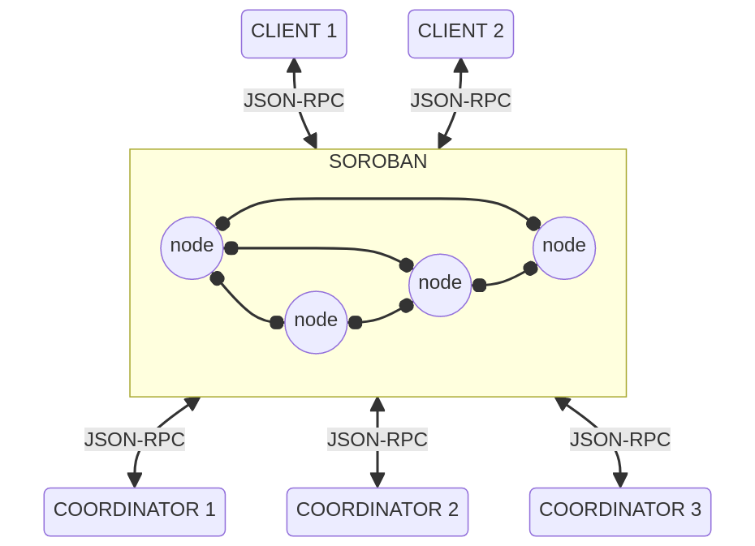
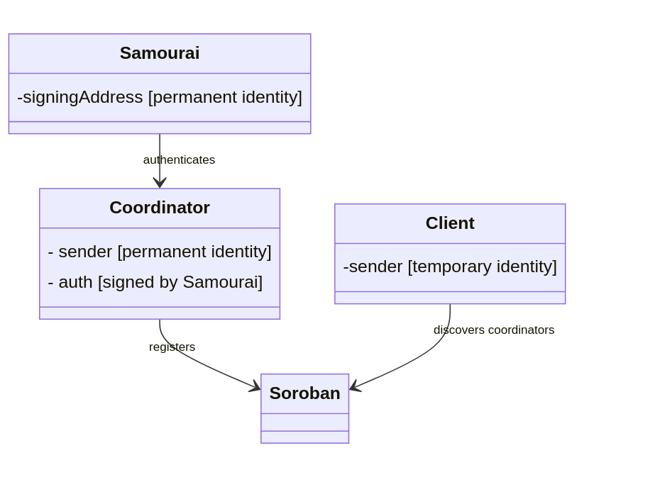

# Whirlpool architecture

## I. Ecosystem

### 1. Whirlpool apps
Whirlpool is available for:
- desktop (windows / mac / linux): [`whirlpool-gui`](https://code.samourai.io/whirlpool/whirlpool-gui) and [`Sparrow Wallet`](https://github.com/sparrowwallet/sparrow)
- command line (java): [`whirlpool-client-cli`](https://code.samourai.io/whirlpool/whirlpool-client-cli)
- Android: [`SamouraiWallet`](https://code.samourai.io/wallet/samourai-wallet-android)

### 2. Developers
Whirlpool is officially implemented in Java:
- main libraries: 
  * [`whirlpool-server`](https://code.samourai.io/whirlpool/whirlpool-server/) for coordinator application
  * [`whirlpool-client`](https://code.samourai.io/whirlpool/whirlpool-client) for  client library
  * [`whirlpool-protocol`](https://code.samourai.io/whirlpool/whirlpool-protocol) for communication protocol
  * [`whirlpool-client-cli`](https://code.samourai.io/whirlpool/whirlpool-client-cli) for client CLI application
- utilities: 
  * [`extlibj`](https://code.samourai.io/wallet/ExtLibJ) for shared Samourai utilities
  * [`bitcoinj`](https://code.samourai.io/wallet/bitcoinj) for Bitcoin implementation (custom BitcoinJ fork by Samourai)
  * [`soroban-client-java`](https://code.samourai.io/wallet/soroban-client-java) for communication over Soroban
  
    

Developers can also reach Whirlpool through:
- REST API embedded by `whirlpool-cli`
- Rust client implemented by Straylight: [`whirlpool-client-rs`](https://github.com/straylight-orbit/whirlpool-client-rs)

## II. Architecture

### 1. Soroban network
Clients and coordinators are communicating through Soroban network. There is no direct connection between clients & coordinators anymore.

Soroban is accessed through JSON-RPC via any available Soroban node, which are accessed from Tor onion hidden-service and/or clearnet. Each node is receiving and relaying messages to the other nodes.  
Bootstrap nodes are defined in [`SorobanServerDex`](https://code.samourai.io/whirlpool/whirlpool-client/-/blob/develop/src/main/java/com/samourai/whirlpool/client/wallet/beans/WhirlpoolServer.java).

### 2. Coordinators discovery

Coordinators are discovered by clients through Soroban.  

Each coordinator is announcing its online presence through Soroban.  
It is identified by a unique `sender` (BIP47 PaymentCode) signed by Samourai key (see [`WhirlpoolNetwork`](https://code.samourai.io/wallet/ExtLibJ/-/blob/develop/src/main/java/com/samourai/whirlpool/client/wallet/beans/WhirlpoolNetwork.java) signingAddress).

Coordinators can go online and offline without any service interruption as clients will automatically switch to the next one.

### 3. Clients identities

Clients are connecting through Soroban with temporary identities  `sender` (on-the-fly generated BIP47 PaymentCodes).  
Each client request (TX0, mixing cycles) is pushed through a random Soroban node and with a fresh identity.  
Within a mixing cycle, client uses a distinct identity to register coinjoin output, making it impossible to link with coinjoin input.

