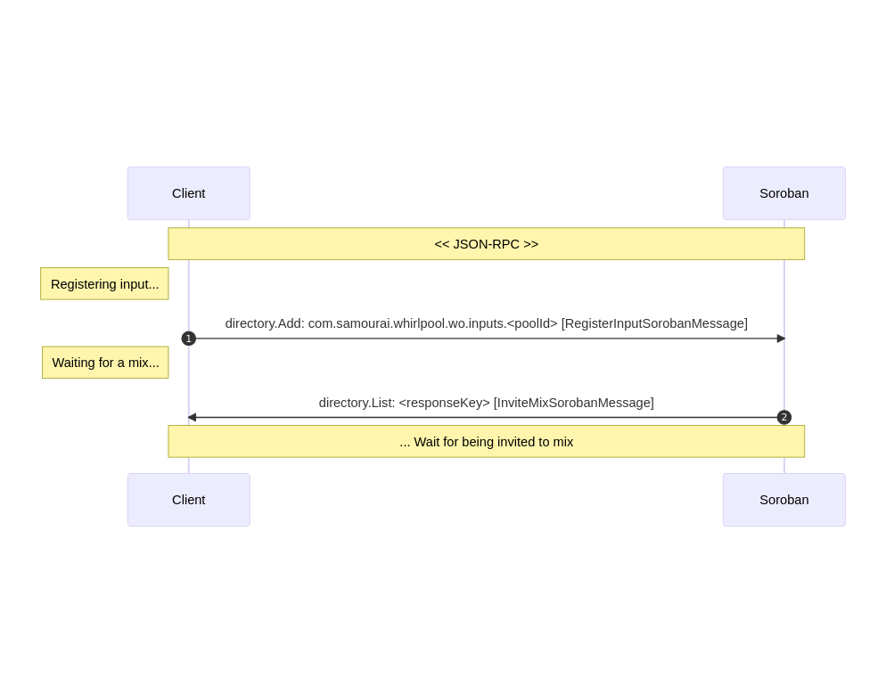
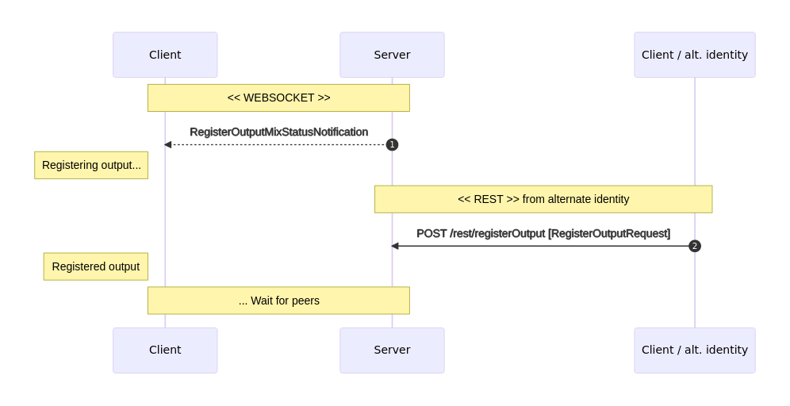

# Whirlpool architecture


## I. General
#### 1. Soroban base directory

Whirlpool uses the following base directory on Soroban:  
`BASE_DIR = NETWORK_ID/PROTOCOL_ID/PROTOCOL_VERSION`
 - NETWORK_ID: `MAINNET` or `TESTNET`
 - PROTOCOL_ID: `WHIRLPOOL`
 - PROTOCOL_VERSION: `1.0`


#### 2. Soroban errors
- always check Soroban payloads for `errorCode` and consider it as errors
- parse errors as [`SorobanErrorMessage`](https://code.samourai.io/wallet/soroban-client-java/-/blob/develop/src/main/java/com/samourai/soroban/protocol/SorobanErrorMessage.java):
    - errorCode: error code (see [`WhirlpoolErrorCode`](https://code.samourai.io/whirlpool/whirlpool-protocol/-/blob/develop/src/main/java/com/samourai/whirlpool/protocol/WhirlpoolErrorCode.java))
    - message: error message


#### 2. Soroban timeouts
- Soroban uses the following timeouts:
    - TIMEOUT_NORMAL: 3 minutes
    - TIMEOUT_SHORT: 30 seconds
When waiting for reply, always consider the request as failed after timeout has passed

## I. Pre-cycle
#### 1. Coordinators discovery

##### 1) Fetch coordinators


| Sender      | Soroban directory                           | Payload                    | Soroban wrapper
--------------|---------------------------------------------|----------------------------|---------
| Coordinator | <BASE_DIR>/COORDINATORS                     | RegisterCoordinatorMessage |  SENDER, SIGN(WhirlpoolNetwork.signingAddress), NONCE

```json
{
  "metadata": {
    "sender": "PM8TJXXdE6XQ9ZSuPDmBHjAtBGUtZnotXFxqP3oaNwgzG4mgoCeAQu6TxwyL2pwxWiB43B3qGC2QcouiG1NFtmeESbG2ePFRnGrgckyoRYbdnzUXU46T",
    "signature": "IPIxEKmVpe57M41N9au0w1K72UFjhCEmqETwdDRn2YkqA+BD26lIsOyYn9ZWjZB4PV3th8big3UAoOhB6VfWP/I=",
    "type": "com.samourai.whirlpool.protocol.soroban.RegisterCoordinatorMessage",
    "nonce": 1707033074347
  },
  "payload": "clear payload..."
}
```

- list `<BASE_DIR>/COORDINATORS`:  
- validate {metadata.signature} as {payload} signed with Samourai key (NOT with {metadata.sender}) (see [`WhirlpoolNetwork`](https://code.samourai.io/wallet/ExtLibJ/-/blob/develop/src/main/java/com/samourai/whirlpool/client/wallet/beans/WhirlpoolNetwork.java) for signingAddress)
- parse {payload} as [`RegisterCoordinatorMessage`](https://code.samourai.io/whirlpool/whirlpool-protocol/-/blob/develop/src/main/java/com/samourai/whirlpool/protocol/soroban/RegisterCoordinatorMessage.java):
    ```json
    {
      "coordinator": {
        "name": "testnet coordinator",
        "sender": "PM8TJXXdE6XQ9ZSuPDmBHjAtBGUtZnotXFxqP3oaNwgzG4mgoCeAQu6TxwyL2pwxWiB43B3qGC2QcouiG1NFtmeESbG2ePFRnGrgckyoRYbdnzUXU46T",
      },
      "pools": [
        {
          "poolId": "2pool1",
          "denomination": 10,
          "feeValue": 11,
          "premixValue": 12,
          "premixValueMin": 13,
          "premixValueMax": 14,
          "tx0MaxOutputs": 15,
          "anonymitySet": 16
        },
        {
          "poolId": "2pool2",
          "denomination": 20,
          "feeValue": 21,
          "premixValue": 22,
          "premixValueMin": 23,
          "premixValueMax": 24,
          "tx0MaxOutputs": 25,
          "anonymitySet": 26
        }
      ]
    }
    ```
    - coordinator: [`CoordinatorInfo`](https://code.samourai.io/whirlpool/whirlpool-protocol/-/blob/develop/src/main/java/com/samourai/whirlpool/protocol/soroban/beans/CoordinatorInfo.java):
        - name: coordinator name
        - sender: same as {metadata.sender}, repeated here to have it signed with Samourai key
    - `pools[]`: array of [`PoolInfo`](https://code.samourai.io/whirlpool/whirlpool-protocol/-/blob/develop/src/main/java/com/samourai/whirlpool/protocol/soroban/beans/PoolInfo.java)
        - poolId: pool identifier
        - denomination: POSTMIX value
        - feeValue: Whirlpool fee
        - premixValue: recommended PREMIX value
        - premixValueMin: min PREMIX value
        - premixValueMax: max PREMIX value
        - tx0MaxOutputs: max count of POSTMIX per Tx0
        - anonymitySet: pool anonymity set
- validate {payload.coordinator.sender} matches {metadata.sender}
- distinct latest valid payloads: with highest {metadata.nonce} per {metadata.sender}

##### 2) Refresh coordinators
Client should maintain the coordinators list locally.  
It should be continuously refreshed to detect new and down coordinators.  
Recommended refresh rate: 10min

#### 2. Create Tx0


##### 1) Fetch TX0 data
| Sender      | Soroban directory                           | Payload                    | Options
--------------|---------------------------------------------|----------------------------|---------
| Client      | <BASE_DIR>/<PAYMENT_CODE_COORDINATOR>/TX0   | Tx0DataRequest             |  ENCRYPT_WITH_SENDER
| Coordinator | <BASE_DIR>/<PAYMENT_CODE_COORDINATOR>/TX0/REPLY/<PAYMENT_CODE_CLIENT>    | Tx0DataResponse, SorobanErrorMessage |  ENCRYPT_WITH_SENDER
```json
{
  "metadata": {
    "sender": "PM8TJRU5xy1NpGfxGgD7gKp9eePXQrh3ZXLs8hAMu4sNfPspCwRiWKUecsNEFJePf3eQcj6GdA7NpuKZTqBrSui51puE1KH5A86K42T1euuvUcP9hMXy",
    "type": "com.samourai.whirlpool.protocol.soroban.tx0.Tx0DataRequest"
  },
  "payload": "encrypted..."
}
```   

- Push [`Tx0DataRequest`](https://code.samourai.io/whirlpool/whirlpool-protocol/-/blob/develop/src/main/java/com/samourai/whirlpool/protocol/soroban/Tx0DataRequest.java) to `<BASE_DIR>/<PAYMENT_CODE_COORDINATOR>/TX0`:
    ```json
    {"scode":null,"partnerId":"SAMOURAI","cascading":false}
    ```  
    - `scode`: discount code (optional)
    - `partnerId`: partner identifier (`SAMOURAI`, `SPARROW`...)
    - `cascading`: `true` for cascading to lower pools
- Wait for reply during TIMEOUT_SHORT on `<BASE_DIR>/<PAYMENT_CODE_COORDINATOR>/TX0/REPLY/<PAYMENT_CODE_CLIENT>`
- Parse reply as [`Tx0DataResponse`](https://code.samourai.io/whirlpool/whirlpool-protocol/-/blob/develop/src/main/java/com/samourai/whirlpool/protocol/soroban/Tx0DataResponse.java):
    - `tx0Datas[]`: array of [`Tx0DataResponse.Tx0Data`](https://code.samourai.io/whirlpool/whirlpool-protocol/-/blob/develop/src/main/java/com/samourai/whirlpool/protocol/soroban/Tx0DataResponse.java#L13) (one per pool)
        - `poolId`: pool identifier
        - `feePaymentCode`: payment code for `feePayload64` obfuscation
        - `feeValue`: Whirlpool fee
        - `feeChange`: fake fee value when `feeValue=0`. You should always use a feeChange output when feeChange>0 to keep the same Tx0 structure for all users and protect against onchain analysis.
        - `feeDiscountPercent`: %discount applied
        - `message`: scode info
        - `feePayload64`: payload for OP_RETURN
        - `feeAddress`: fee destination
        - `feeOutputSignature`: Bitcoin signature of the fee txout (specified by `feeAddress` and `feeValue`) serialization (https://developer.bitcoin.org/reference/transactions.html#txout-a-transaction-output), signed by Samourai key (see [`WhirlpoolNetwork`](https://code.samourai.io/wallet/ExtLibJ/-/blob/develop/src/main/java/com/samourai/whirlpool/client/wallet/beans/WhirlpoolNetwork.java) for signingAddress)

##### 2) Build the TX0
- [1-N] deposit inputs (confirmed or not)
- [1-N] PREMIX outputs (max count `PoolInfo.tx0MaxOutputs`) of the same value (`PoolInfo.mustMixBalanceMin <= value <= PoolInfo.mustMixBalanceCap`)
- 1 Whirlpool fee output of `feeValue` to `feeAddress`, when `feeValue>0`
- 1 fake Whirlpool fee output of `feeChange` to DEPOSIT, when `feeValue=0`
- 1 OP_RETURN (80 bytes) generated by concatenating following elements:
    - feePayloadMasked (46 bytes): result of `xorMask(feePayload64, signingKey, feePaymentCode)` truncated on 46 bytes
    - signingPublicKey (33 bytes): the public key used for xorMask (this can be any key)
    - OP_RETURN_VERSION (1 byte): value of `1`
    See [`FeeOpReturnImplV1.computeOpReturn()`](https://code.samourai.io/whirlpool/whirlpool-protocol/-/blob/develop/src/main/java/com/samourai/whirlpool/protocol/feeOpReturn/FeeOpReturnImplV1.java#L63) or [`FeeOpReturnImplV1Test`](https://code.samourai.io/whirlpool/whirlpool-protocol/-/blob/develop/src/test/java/com/samourai/whirlpool/protocol/feeOpReturn/FeeOpReturnImplV1Test.java#L92) for implementation details.
- eventual change output to DEPOSIT

##### 3. Submit the TX0

| Sender      | Soroban directory                           | Payload                    | Options
--------------|---------------------------------------------|----------------------------|---------
| Client      | <BASE_DIR>/<PAYMENT_CODE_COORDINATOR>/TX0   | Tx0PushRequest             |  ENCRYPT_WITH_SENDER
| Coordinator | <BASE_DIR>/<PAYMENT_CODE_COORDINATOR>/TX0/REPLY/<PAYMENT_CODE_CLIENT>    | Tx0PushResponseSuccess, Tx0PushResponseError |  ENCRYPT_WITH_SENDER
```json
{
  "metadata": {
    "sender": "PM8TJRU5xy1NpGfxGgD7gKp9eePXQrh3ZXLs8hAMu4sNfPspCwRiWKUecsNEFJePf3eQcj6GdA7NpuKZTqBrSui51puE1KH5A86K42T1euuvUcP9hMXy",
    "type": "com.samourai.whirlpool.protocol.soroban.tx0.Tx0PushRequest"
  },
  "payload": "encrypted..."
}
``` 

- Push [`Tx0PushRequest`](https://code.samourai.io/whirlpool/whirlpool-protocol/-/blob/develop/src/main/java/com/samourai/whirlpool/protocol/soroban/Tx0PushRequest.java) to `<BASE_DIR>/<PAYMENT_CODE_COORDINATOR>/TX0` :
    ```json
    {
      "tx64": "txhex...",
      "poolId": "0.001btc"
    }
    ```  
    - tx64: transaction to push
    - poolId: pool identifier
- Wait for reply during TIMEOUT_SHORT on `<BASE_DIR>/<PAYMENT_CODE_COORDINATOR>/TX0/REPLY/<PAYMENT_CODE_CLIENT>`
- On success, parse reply as [`Tx0PushResponseSuccess`](https://code.samourai.io/whirlpool/whirlpool-protocol/-/blob/develop/src/main/java/com/samourai/whirlpool/protocol/soroban/Tx0PushResponseSuccess.java):
    ```json
    {
      "txid": "..."
    }
    ```  
    - txid: transaction id successfully pushed
- On error, parse reply as [`Tx0PushResponseError`](https://code.samourai.io/whirlpool/whirlpool-protocol/-/blob/develop/src/main/java/com/samourai/whirlpool/protocol/soroban/Tx0PushResponseError.java):
    ```json
    {
      "errorCode": 620,
      "message": "test",
      "pushTxError": {
        "error": "test",
        "voutsAddressReuse": null
      }
    }
    ```
    - errorCode: error code (see [`WhirlpoolErrorCode`](https://code.samourai.io/whirlpool/whirlpool-protocol/-/blob/develop/src/main/java/com/samourai/whirlpool/protocol/WhirlpoolErrorCode.java))
    - message: error message
    - pushTxErrorCode: failure reason
    - voutsAddressReuse: (optional) output indexes encountering address-reuse

#### 3. Address reuse prevention

Any `receiveAddress` already known by coordinator will be declined. The client should keep a local POSTMIX index to increment on REGISTER_OUTPUT, and never be roll it back even in case of a mix failure.   
Reusing an already known `receiveAddress` will be rejected, and the client will be blamed/banned when causing mixing failures.  

To make sure a `receiveAddress` is unknown to the server, we suggest using the `/seen` service (from backend or OXT) at client startup.  
We also suggest to use it in case of REGISTER_OUTPUT failure.

TODO


#### 4. REGISTER_INPUT to Soroban


| Sender      | Soroban directory                                                                         | Payload                                       | Options
--------------|-------------------------------------------------------------------------------------------|-----------------------------------------------|---------
| Client      | <BASE_DIR>/<PAYMENT_CODE_COORDINATOR>/REGISTER_INPUT                                      | RegisterInputRequest                          |  ENCRYPT_WITH_SENDER, NONCE
| Coordinator | <BASE_DIR>/<PAYMENT_CODE_COORDINATOR>/REGISTER_INPUT/REPLY/<PAYMENT_CODE_CLIENT>          | RegisterInputResponse or SorobanErrorMessage  |  ENCRYPT_WITH_SENDER
```json
{
  payload: "encrypted...",
  metadata: {
    "sender": "PM8TJhhm4tsshfcBVTGbhqCPFQFecQ7ArkkaVmrFUbgYbNLvN8vFFc5vbWhk2K78zwknoa7VNYuRSnNri3Xb1ARCsiQEJnpzrVwyad5aNgj8QfwmbuHy",
    "type": "com.samourai.whirlpool.protocol.soroban.RegisterInputRequest",
    "nonce": 1707081247328
  }
}
```
- Push [`RegisterInputRequest`](https://code.samourai.io/whirlpool/whirlpool-protocol/-/blob/develop/src/main/java/com/samourai/whirlpool/protocol/soroban/RegisterInputRequest.java) to `<BASE_DIR>/<PAYMENT_CODE_COORDINATOR>/REGISTER_INPUT`:
    ```json
    {
      "poolId": "0.001btc",
      "utxoHash": "hash...",
      "utxoIndex": 10,
      "signature": "signature...",
      "liquidity": true,
      "blockHeight": 12345
    }
    ```
    - `poolId`: pool to mix-to
    - `utxoHash` & `utxoIndex`: a PREMIX or POSTMIX utxo (must have >= 1 confirmations)
    - `signature`: message "$poolId" signed with utxo's key
    - `liquidity`: true for PREMIX, false for POSTMIX
    - `blockHeight`: height of the latest block

- Wait for reply during TIMEOUT_NORMAL on `<BASE_DIR>/<PAYMENT_CODE_COORDINATOR>/REGISTER_INPUT/REPLY/<PAYMENT_CODE_CLIENT>`  
It takes generally a few minutes to be selected for the first mix (and a few hours for a free remix), so it's normal to not get a reply immediately.  
Loop with pushing request and waiting until getting selected for a mix. 

- Parse reply as [`RegisterInputResponse`](https://code.samourai.io/whirlpool/whirlpool-protocol/-/blob/develop/src/main/java/com/samourai/whirlpool/protocol/soroban/RegisterInputResponse.java):
      ```json
      {
        "mixId":"...",
        "mixPublicKey":"..."
      }
      ```  
    - `mixId`: unique identifier of the mix round to join
    - `mixPublicKey`: public key to use for chaumian blinding
        


## V. Cycle dialog

### A. Succesful mix process
This section describes the standard mix process.  

#### 1. CONFIRM_INPUT


| Sender      | Soroban directory                                                                         | Payload                                       | Options
--------------|-------------------------------------------------------------------------------------------|-----------------------------------------------|---------
| Client      | <BASE_DIR>/<PAYMENT_CODE_COORDINATOR>/MIX/<MIX_ID>                                        | ConfirmInputRequest                           |  ENCRYPT_WITH_SENDER
| Coordinator | <BASE_DIR>/<PAYMENT_CODE_COORDINATOR>/MIX/<MIX_ID>/REPLY/<PAYMENT_CODE_CLIENT>            | ConfirmInputResponse or SorobanErrorMessage   |  ENCRYPT_WITH_SENDER
```json
{
  payload: "encrypted...",
  metadata: {
    "sender": "PM8TJhhm4tsshfcBVTGbhqCPFQFecQ7ArkkaVmrFUbgYbNLvN8vFFc5vbWhk2K78zwknoa7VNYuRSnNri3Xb1ARCsiQEJnpzrVwyad5aNgj8QfwmbuHy",
    "type": "com.samourai.whirlpool.protocol.soroban.RegisterInputRequest",
  }
}
```

- Generate a fresh `bordereau` which must be unique, such as 30 random bytes
- Generate a fresh POSTMIX `receiveAddress` (bech32) which was **NEVER used** yet, including in failed mixs. See "Address reuse prevention" for this.
- Generate a fresh `RSABlindingParameters` from `RegisterInputResponse.mixPublicKey`
- Push [`ConfirmInputRequest`](https://code.samourai.io/whirlpool/whirlpool-protocol/-/blob/develop/src/main/java/com/samourai/whirlpool/protocol/soroban/ConfirmInputRequest.java) to `<BASE_DIR>/<PAYMENT_CODE_COORDINATOR>/MIX/<MIX_ID>`:
    ```json
    {
      "blindedBordereau64": "...",
      "userHash": "hash..."
    }
    ```
    - `blindedBordereau64`: `chaumianBlind(bordereau, RSABlindingParameters)`
    - `userHash`: identifier which should be unique for your {wallet,mixId}.  
     We use this to prevent client mixing with its own wallet when using multiple instances simultaneously (Android, CLI).  
         - it must be unique for your wallet
         - it must be unique for {mixId}, so that coordinator cannot link your inputs across mixs.  
         Example: `sha256(mixId + sha256(premixAddressBech32[0][0]))`

- Wait for reply during TIMEOUT_SHORT on `<BASE_DIR>/<PAYMENT_CODE_COORDINATOR>/MIX/<MIX_ID>/REPLY/<PAYMENT_CODE_CLIENT>`  
Loop with pushing request and waiting until getting a reply.  

- Parse reply as [`ConfirmInputResponse`](https://code.samourai.io/whirlpool/whirlpool-protocol/-/blob/develop/src/main/java/com/samourai/whirlpool/protocol/soroban/ConfirmInputResponse.java):  
      ```json
      {
        "signedBordereau64":"..."
      }
      ```  
    - `signedBordereau64`: chaumian signature of `blindedBordereau64` for the mix
    

#### 2. REGISTER_OUTPUT

- Client receives [`RegisterOutputMixStatusNotification`](https://code.samourai.io/whirlpool/whirlpool-protocol/-/blob/develop/src/main/java/com/samourai/whirlpool/protocol/websocket/notifications/RegisterOutputMixStatusNotification.java):
    - `inputsHash`: hash of all mixs inputs = `sha512(join(sort(inputHash+inputIndex)))` used as an anonymous verifiable mix round identifier.

- Client increments it's local POSTMIX counter to make sure that it won't ever submit again this `receiveAddress`, even if mix fails.

- Client submits [`RegisterOutputRequest`](https://code.samourai.io/whirlpool/whirlpool-protocol/-/blob/develop/src/main/java/com/samourai/whirlpool/protocol/rest/RegisterOutputRequest.java) through a different identity:
    - `inputsHash`
    - `bordereau64`: the bordereau generated during CONFIRM_INPUT
    - `unblindedSignedBordereau64` = `chamianUnblind(signedBordereau64, RSABlindingParameters)`
    - `receiveAddress`

- If `RegisterOutputRequest` fails because of reusing existing `receiveAddress`, Client can retry submitting `RegisterOutputRequest` with a different `receiveAddress`.  
If Client cannot find a fresh `receiveAddress` before mix is over, it should run `CheckOutput` process to fix it's local postmix counter (see below).

#### 3. SIGNING & SUCCESS

- Client receives [`SigningMixStatusNotification`](https://code.samourai.io/whirlpool/whirlpool-protocol/-/blob/develop/src/main/java/com/samourai/whirlpool/protocol/websocket/notifications/SigningMixStatusNotification.java):
    - `transaction64`: raw transaction to sign

- Client checks that `inputsHash` matches
- Client checks it's input among tx inputs
- Client checks it's output among tx outputs
- Client generates `witnesses64` by signing the transaction
- Client submits [`SigningRequest`](https://code.samourai.io/whirlpool/whirlpool-protocol/-/blob/develop/src/main/java/com/samourai/whirlpool/protocol/websocket/messages/SigningRequest.java):
    - `mixId`
    - `witnesses64`
- Client receives [`SuccessMixStatusNotification`](https://code.samourai.io/whirlpool/whirlpool-protocol/-/blob/develop/src/main/java/com/samourai/whirlpool/protocol/websocket/notifications/SuccessMixStatusNotification.java)
- Client disconnects

### B. Mix failure

#### 1. REVEAL_OUTPUT process
This process will trigger if a peer fails to REGISTER_OUTPUT, causing the mix to fail.  
Each client should reveal its registered output to coordinator, which will find and blame the faulty client.

- Client receives [`RevealOutputMixStatusNotification`](https://code.samourai.io/whirlpool/whirlpool-protocol/-/blob/develop/src/main/java/com/samourai/whirlpool/protocol/websocket/notifications/RevealOutputMixStatusNotification.java)
- Client submits [`RevealOutputRequest`](https://code.samourai.io/whirlpool/whirlpool-protocol/-/blob/develop/src/main/java/com/samourai/whirlpool/protocol/websocket/messages/RevealOutputRequest.java):
    - `mixId`
    - `receiveAddress`


#### 2. Mix failure

- Client receives [`FailMixStatusNotification`](https://code.samourai.io/whirlpool/whirlpool-protocol/-/blob/develop/src/main/java/com/samourai/whirlpool/protocol/websocket/notifications/FailMixStatusNotification.java)
- Client disconnects and restarts the whole cycle dialog.


#### 3. Ban policy
Client should avoid disconnecting after receiving `RegisterOutputMixStatusNotification`. If client disconnects during `REGISTER_OUTPUT` or `SIGNING`, it will ruin the mix and client may be temporarily banned after too many disconnects.
